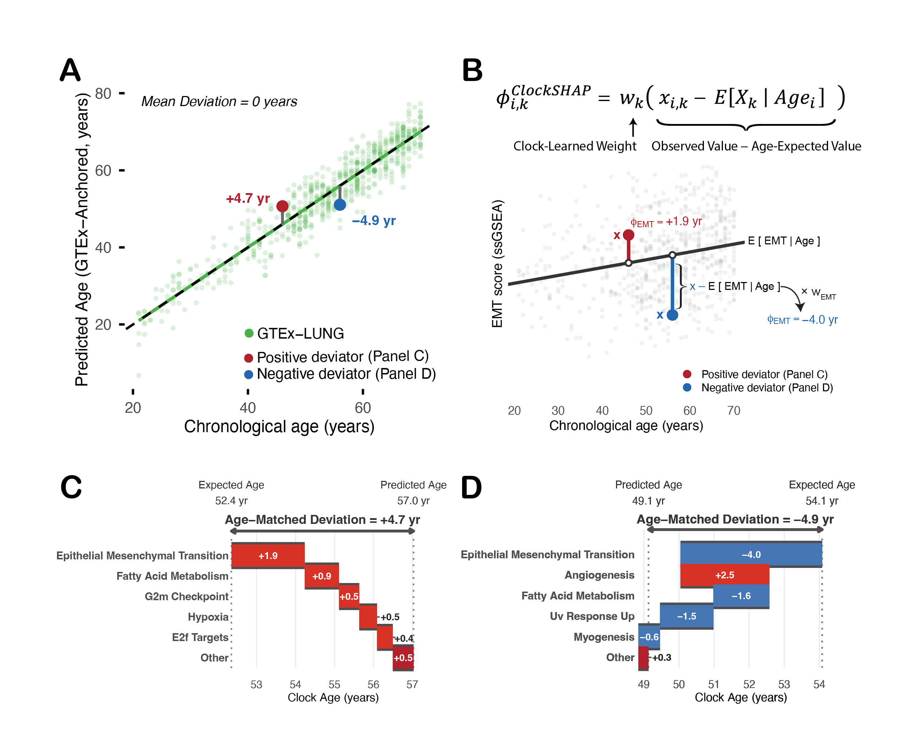
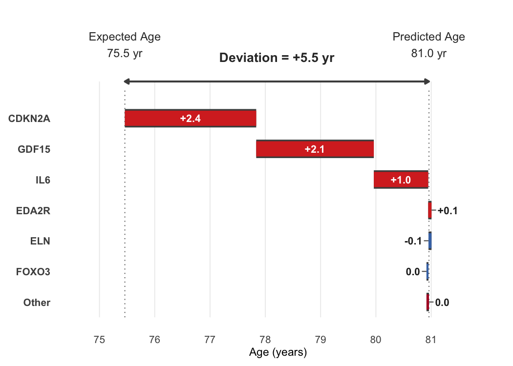

<!-- README.md is generated from README.Rmd. Please edit that file -->

# ClockSHAP

ClockSHAP is an interpretability framework for **linear-additive aging
clocks** (e.g., transcriptomic, epigenetic, or proteomic clocks fit with
linear, ridge, or elastic-net regression).

It answers a single question:

> **Why is this sample predicted to be older or younger than expected
> for its chronological age?**

The method was developed for tissue-of-origin transcriptomic aging clocks
but is designed to support comparative aging analyses across diverse
clock contexts.



*ClockSHAP applied to a lung-tissue aging clock on real GTEx-LUNG data.
(A) Predicted vs. chronological age across the cohort, with one positive
and one negative deviator highlighted. (B) A single feature’s
contribution, computed as its clock weight times its distance from the
age-expected value. (C, D) The full per-feature decompositions for the
two deviators, with contributions summing exactly to each sample’s
age-matched deviation. Figure from \[Bock et al., in preparation\].*

------------------------------------------------------------------------

## What you get out of ClockSHAP

For each sample, ClockSHAP returns its **age-matched deviation** (how
far the predicted clock age sits above or below what is expected at that
chronological age) together with **per-feature contributions that sum
exactly to that deviation**.

The figure above shows this on real lung-tissue data for a pathway-level
transcriptomic clock. The positive deviator (Panel C) reads about 4.7
years older than expected, attributed to programs such as
epithelial–mesenchymal transition (+1.9 years) and fatty-acid metabolism
(+0.9); the negative deviator (Panel D) reads about 4.9 years younger,
driven largely by low EMT (−4.0). In both cases the contributions sum
*exactly* to the deviation, a guarantee of the method rather than an
approximation.

This output feeds downstream analyses: comparing which features drive
deviation across a cohort, deep dives on individual samples, or
hypothesis generation about which biological programs are differentially
engaged.

Because the reference here is the GTEx-LUNG cohort itself, the
deviations shown are *exactly* the commonly used **relative age
acceleration** (RAA), the residual of predicted age regressed on
chronological age, which is why Panel A’s mean deviation is zero. See
[Terminology: deviation vs. AAA
vs. RAA](#terminology-deviation-vs-aaa-vs-raa) below for the details.

------------------------------------------------------------------------

## Installation

``` r
# Recommended
install.packages("pak")
pak::pak("montilab/ClockSHAP")

# Alternative
install.packages("remotes")
remotes::install_github("montilab/ClockSHAP")
```

------------------------------------------------------------------------

## Quick start

ClockSHAP needs three things: a **feature matrix** (samples in rows,
features in columns), a vector of **chronological ages** (one per
sample), and a **clock** describing how those features map to predicted
age. The bundled `clockshap_example` supplies all three, so we can look
at the expected shapes first:

``` r
library(ClockSHAP)

# Features: rows are samples, columns are the clock's features.
# (If your matrix is genes x samples, transpose it first.)
clockshap_example$features[1:3, 1:4]
#>        CDKN2A    GDF15    EDA2R      IL6
#> S001 7.034590 7.851806 5.223082 6.046552
#> S002 5.641907 6.397235 5.266366 4.738019
#> S003 5.293459 6.050086 3.950593 4.233756

# One chronological age per sample
head(data.frame(
  sample = names(clockshap_example$age),
  age    = unname(clockshap_example$age)
))
#>   sample  age
#> 1   S001 80.3
#> 2   S002 81.5
#> 3   S003 45.7
#> 4   S004 75.7
#> 5   S005 65.3
#> 6   S006 58.6

# The clock: an intercept (alpha), per-feature weights (beta), and the
# training mean/SD used to standardize each feature (mu, sigma)
str(clockshap_example$clock)
#> List of 4
#>  $ alpha: num 59
#>  $ beta : Named num [1:8] 3.43 3.08 2.65 1.67 -2.08 ...
#>   ..- attr(*, "names")= chr [1:8] "CDKN2A" "GDF15" "EDA2R" "IL6" ...
#>  $ mu   : Named num [1:8] 5.34 6.23 4.46 4.6 5.68 ...
#>   ..- attr(*, "names")= chr [1:8] "CDKN2A" "GDF15" "EDA2R" "IL6" ...
#>  $ sigma: Named num [1:8] 1.034 1.074 0.933 1.126 0.998 ...
#>   ..- attr(*, "names")= chr [1:8] "CDKN2A" "GDF15" "EDA2R" "IL6" ...
#>  - attr(*, "class")= chr "linear_clock"
```

For your own model you build this object with
`linear_clock(alpha, beta, mu, sigma)` from its fitted coefficients; the
feature columns just have to be named to match. With those inputs in
hand, the workflow is three calls: fit an age-conditioned reference from
the data, run the decomposition, and inspect a sample.

``` r
# Age-conditioned reference profile (defines "expected for age"), fit from the data
ref <- fit_reference_profile(
  features = as.data.frame(clockshap_example$features),
  age      = clockshap_example$age
)

# Decompose each sample's age-matched deviation into per-feature contributions
cs <- clockshap(
  features  = clockshap_example$features,
  age       = clockshap_example$age,
  clock     = clockshap_example$clock,
  reference = ref
)

# Inspect one sample's decomposition as a waterfall
plot_clockshap_waterfall(cs, sample = 1, top_n = 6)
```



The returned `clockshap` object is a list with five fields:

-   `predicted`: clock prediction $\hat{y}$
-   `expected`: age-matched expectation
    $\mathrm{E}[\hat{y} \mid \mathrm{Age}]$ under the reference
-   `deviation`: `predicted - expected` ($\Delta$)
-   `phi`: per-feature contribution matrix (rows sum exactly to
    `deviation`)
-   `age`: input chronological ages

------------------------------------------------------------------------

## How it works (in two lines)

ClockSHAP is built around two identities. The first defines what it
explains: the age-matched deviation of a sample’s predicted age from its
age-matched expectation,

$$\Delta_i = \hat{y}_i - \mathrm{E}[\hat{y} \mid \mathrm{Age}_i]$$

The second is the exact additive decomposition of that deviation into
per-feature contributions,

$$\sum_k \phi_{i,k} = \Delta_i$$

Here $\hat{y}$ is the clock’s predicted age,
$\mathrm{E}[\hat{y} \mid \mathrm{Age}]$ is the age-matched expectation
under a reference, and $\phi$ is a single feature’s contribution.
Everything below is about how the expectation and the contributions are
defined, and why the decomposition is exact.

------------------------------------------------------------------------

## The building blocks

The rest of this README explains the two identities above:

-   what `expected` means (the reference profile),
-   why the per-feature contributions $\phi_k$ sum exactly to the
    deviation (the SHAP property),
-   how the deviation differs from other clock-acceleration metrics
    (AAA, RAA).

### How `expected` is defined: the reference profile

Aging-clock features change systematically with chronological age, so a
single global baseline is inappropriate for comparing samples of
different ages. ClockSHAP instead uses an **age-conditioned reference**.
For each feature $k$ it fits an age trend on a reference cohort:

$$\mathrm{E}[X_k \mid \mathrm{Age}] = \gamma_{0,k} + \gamma_{1,k}\,\mathrm{Age}$$

Passing this age-expected feature vector through the clock $f$ gives the
age-matched expectation, and the deviation is the gap from it:

$$\mathrm{E}[\hat{y} \mid \mathrm{Age}] = f\big(\mathrm{E}[X \mid \mathrm{Age}]\big), \qquad \Delta = \hat{y} - \mathrm{E}[\hat{y} \mid \mathrm{Age}]$$

So `expected` is the clock’s *typical output for reference individuals
of the same chronological age*, and the deviation is how far above or
below that a sample lies.

**Reference note.** Because `expected` depends on the chosen reference
(e.g., GTEx tissue-of-origin), the deviation should be interpreted
**relative to that reference**; it is not a universal biological-age
score.

**Interpretation note.** The deviation is a cross-sectional **state
shift** relative to an age-matched expectation; it does not by itself
imply a within-individual aging *rate*.

### Why the contributions sum exactly to the deviation: the SHAP property

For **linear-additive models**, SHAP-style attributions have a closed
form. ClockSHAP’s per-feature contribution is the feature’s clock weight
$w_k$ times its distance from the age-expected value, the form shown in
Panel B of the figure above:

$$\phi_{i,k} = w_k\big(x_{i,k} - \mathrm{E}[X_k \mid \mathrm{Age}_i]\big)$$

Summed over features, the contributions recover the deviation exactly:

$$\sum_k \phi_{i,k} = \Delta_i$$

**Implementation note.** In practice the features are standardized to
the clock’s training distribution (mean and standard deviation) before
the decomposition is computed. Changing the reference changes the
expectation, and therefore the decomposition target, so every component
is reference-anchored.

### Terminology: deviation vs. AAA vs. RAA

ClockSHAP explains $\Delta = \text{predicted} - \text{expected}$, not
raw prediction error. Two other quantities appear in the aging-clock
literature:

**Absolute age acceleration (AAA, sometimes called ΔAge):**

$$\mathrm{AAA} = \hat{y} - \mathrm{Age}$$

Simple, but age-biased when the clock slope is below 1: younger samples
are over-predicted and older samples under-predicted.

**Relative age acceleration (RAA, regression residuals):**

``` r
RAA <- residuals(stats::lm(predicted ~ age))
```

A post-hoc calibration that removes systematic age trends in prediction
error within a chosen cohort.

**ClockSHAP deviation.** ClockSHAP’s $\Delta$ generalizes RAA. The
age-conditional expectation is built through a **feature-level reference
profile** ($\gamma_0 + \gamma_1\,\mathrm{Age}$ per feature, passed
through the clock) rather than by regressing $\hat{y}$ on age directly.
This has an exact special case: **for a linear-additive clock, when the
reference is fit on the cohort of interest itself, $\Delta$ equals RAA
sample-for-sample.** Because $\hat{y}$ is an exact linear function of
the features and OLS projection onto age is linear, passing the
per-feature age trends through the clock reproduces the OLS fit of
$\hat{y} \sim \mathrm{Age}$ exactly, so
$\text{predicted} - \text{expected} = \text{predicted} - \text{fitted} = \text{residual} = \mathrm{RAA}$.

An additional usage of ClockSHAP is what happens when the reference is
set to a *different*, biologically meaningful cohort (e.g., GTEx
tissue-of-origin): `expected` is then anchored to normal aging in that
reference rather than to the target cohort’s own internal trend, and the
deviation measures departure from that external expectation.

We recommend the name **“deviation”** or **“age-matched deviation”** to
keep this distinct from AAA and RAA.

------------------------------------------------------------------------

## Practical notes

-   **Deviation is reference-dependent.** The choice of reference cohort
    defines what “expected for age” means.
-   **“Years” are clock-relative.** A deviation of +5 under one clock is
    not comparable to +5 under a different clock, training set, or
    feature space.
-   **Upstream preprocessing matters a lot.** ClockSHAP assumes the
    feature matrix is analysis-ready and consistent with the clock
    (transformations, normalization, feature matching, batch correction,
    QC). Mismatched feature spaces or batch effects produce technical,
    not biological, deviations. The importance of this step cannot be
    overstated.

For broader discussion of calibration, age bias, and computational
challenges in clock analysis, see [Epigenetic ageing clocks: statistical
methods and emerging computational
challenges](https://doi.org/10.1038/s41576-024-00807-w) (Nature Reviews
Genetics).

------------------------------------------------------------------------

## Status

Under active development.
