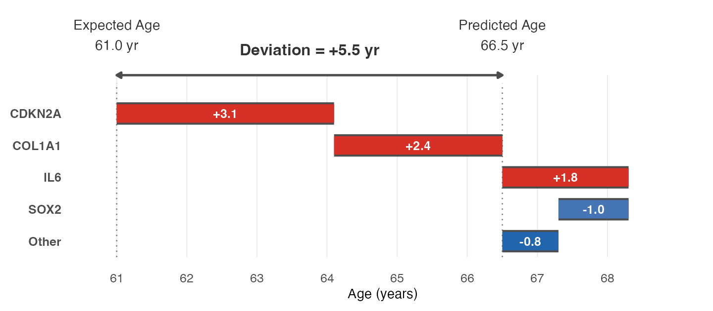

# ClockSHAP

ClockSHAP is an interpretability framework for **linear-additive aging clocks** (e.g., transcriptomic, epigenetic, or proteomic clocks fit with linear, ridge, or elastic-net regression).

It answers a single question:

> **Why is this sample predicted to be biologically older or younger than expected for its chronological age?**

The method was developed in the context of tissue-anchored transcriptomic aging clocks but is designed to support comparative aging analyses across diverse clock contexts.

---

## What you get out of ClockSHAP

For each sample, ClockSHAP returns a per-feature decomposition of how far that sample lies above or below the clock's age-matched expectation. A worked example (illustrative numbers):

```
Sample ID:            TCGA-XX-1234
Chronological age:    58 years
Predicted clock age:  66.5 years   <- y_hat
Expected for age 58:  61 years     <- y_exp(age) from reference profile
Deviation:            +5.5 years   <- predicted - expected

Top feature contributions (phi, sum exactly to deviation):
  CDKN2A      +3.1
  COL1A1      +2.4
  IL6         +1.8
  SOX2        -1.0
  Other (remaining features) -0.8
  ------------------------
  Total       +5.5
```

The interpretation is direct: this sample is 5.5 clock-years older than expected for a 58-year-old in the reference cohort, and CDKN2A, COL1A1, and IL6 are the dominant drivers.

This output drops into downstream analyses — cohort-level comparisons of which features drive deviation, deep dives on individual samples, or hypothesis generation about which biological programs are differentially engaged.

`plot_clockshap_waterfall(cs, sample = i)` renders this decomposition as a waterfall plot.

Worked-example visualization (same illustrative numbers as above):



---

## How it works (in two lines)

ClockSHAP is built around two equations:

```text
deviation     = predicted - expected
sum_k phi[k]  = deviation
```

Everything else in this README is about how `expected` and `phi` are defined and why the additive decomposition holds exactly.

---

## Installation

```r
# Recommended
install.packages("pak")
pak::pak("montilab/ClockSHAP")

# Alternative
install.packages("remotes")
remotes::install_github("montilab/ClockSHAP")
```

---

## Quick start

Here is the core workflow using the bundled synthetic `clockshap_example` dataset.

```r
library(ClockSHAP)

ref <- fit_reference_profile(
  features = as.data.frame(clockshap_example$features),
  age      = clockshap_example$age
)

cs <- clockshap(
  features  = clockshap_example$features,
  age       = clockshap_example$age,
  clock     = clockshap_example$clock,
  reference = ref
)

cs$phi
cs$deviation
cs$predicted
cs$expected

cor(cs$predicted, clockshap_example$age)
max(abs(rowSums(cs$phi) - cs$deviation))

plot_clockshap_waterfall(cs, sample = "S001", top_n = 6)
```

The returned `clockshap` object is a list with five fields:

- `predicted` — clock prediction `y_hat`
- `expected` — age-matched expectation `y_exp(age)` under the reference
- `deviation` — `predicted - expected`
- `phi` — per-feature contribution matrix (rows sum exactly to `deviation`)
- `age` — input chronological ages

---

## The building blocks

The rest of this README explains the two equations above:

- What `expected` means (the reference profile)
- Why per-feature `phi` values exist and sum exactly to `deviation` (the SHAP property)
- How `deviation` differs from other clock-acceleration metrics (AAA, RAA)

### How `expected` is defined: the reference profile

Aging-clock features change systematically with chronological age. A single global mean baseline is inappropriate for comparing samples of different ages, so ClockSHAP uses an **age-conditioned reference**.

For each feature `k`, we fit an age trend on a reference cohort:

```text
x_ref[k](age) = gamma0[k] + gamma1[k] * age
```

`gamma0[k]` and `gamma1[k]` are stored in the `reference_profile` object. Given a clock `f` mapping features to predicted age:

```text
y_exp(age)  = f( x_ref(age) )
deviation   = y_hat - y_exp(age)
```

So `expected` is the clock's *typical output for reference individuals of the same chronological age*, and `deviation` is how far above or below that age-matched expectation a sample lies.

**Reference note.** Because `expected` depends on the chosen reference (e.g., GTEx tissue-of-origin), `deviation` should be interpreted **relative to that reference**. It is not a universal biological-age score.

**Interpretation note.** `deviation` is a cross-sectional **state shift** relative to an age-matched expectation; it does not by itself imply a within-individual aging *rate*.

### Why per-feature contributions sum exactly to `deviation`: the SHAP property

For **linear-additive models**, SHAP-style additive attributions have a closed form. Writing the clock on standardized features:

```text
y_hat = alpha + sum_k beta[k] * z[k]
z[k]  = (x[k] - mu[k]) / sigma[k]
```

Given a standardized baseline `z_ref`, linear-model SHAP values reduce to:

```text
phi[k]        = beta[k] * ( z[k] - z_ref[k] )
sum_k phi[k]  = y_hat(x) - y_hat(z_ref)
```

ClockSHAP sets the baseline using the age-conditioned reference profile:

```text
x_ref[k](age)     = gamma0[k] + gamma1[k] * age
z_ref[k](age)     = ( x_ref[k](age) - mu[k] ) / sigma[k]

y_exp(age)        = alpha + sum_k beta[k] * z_ref[k](age)
phi[k](age)       = beta[k] * ( z[k] - z_ref[k](age) )
sum_k phi[k](age) = deviation
```

This preserves exact additivity while making the baseline biologically appropriate for aging-clock interpretation.

**Implementation note.** Changing the reference changes `expected(age)` and therefore changes the decomposition target. Every component of the output is reference-anchored.

### Terminology: deviation vs. AAA vs. RAA

ClockSHAP explains **`predicted − expected`**, not raw prediction error. Two other quantities are commonly used in the aging-clock literature, and it is worth being explicit about which one ClockSHAP targets.

**Absolute age acceleration (AAA, sometimes called ΔAge):**

```text
AAA = y_hat - age
```

Simple, but age-biased when the clock has slope < 1: younger samples get over-predicted and older samples under-predicted.

**Relative age acceleration (RAA, regression residuals):**

```r
RAA <- residuals(stats::lm(predicted ~ age))
```

A post hoc calibration that removes systematic age trends in prediction error within a chosen cohort.

**ClockSHAP deviation (`predicted − expected`):**

ClockSHAP's `deviation` generalizes RAA. The age-conditional expectation is built through a **feature-level reference profile** (per-feature OLS trends `gamma0 + gamma1 * age`, passed through the clock) rather than by regressing `y_hat` on age directly. This has an exact special case: **for a linear-additive clock, when the reference profile is fit on the cohort of interest itself, `deviation` equals RAA sample-for-sample.** Because `y_hat` is an exact linear function of the features and OLS projection onto age is linear, passing the per-feature age trends through the clock reproduces the OLS fit of `y_hat ~ age` exactly, so `predicted − expected = predicted − fitted = residual = RAA`.

The purpose of ClockSHAP is what happens when the reference is set to a *different*, biologically meaningful cohort (e.g., GTEx tissue-of-origin). `expected` is then anchored to normal aging in that reference rather than to the target cohort's own internal trend, and `deviation` measures departure from that external expectation. 

We recommend the name **"deviation"** or **"age-matched deviation"** to keep this distinct from AAA and RAA.

---

## Practical notes

- **Deviation is reference-dependent.** Choice of reference cohort defines what "expected for age" means.
- **"Years" are clock-relative.** A deviation of +5 under one clock is not comparable to +5 under a different clock, training set, or feature space.
- **Upstream preprocessing matters — a lot.** ClockSHAP assumes the feature matrix is analysis-ready and consistent with the clock (transformations, normalization, feature matching, batch correction, QC). Mismatched feature spaces or batch effects produce technical, not biological, deviations. The importance of this step cannot be overstated.

For broader discussion of calibration, age bias, and computational challenges in clock analysis, see [Epigenetic ageing clocks: statistical methods and emerging computational challenges](https://doi.org/10.1038/s41576-024-00807-w) (Nature Reviews Genetics).

---

## Status

Under active development.
